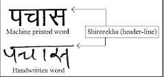

<h1 align = "center">Mosaic-PS1 </h1>

<h2 align = "center"><b>Hindi Word Recognizer</b></h2>
<p align="center">
    
</p>

This Repo contains our approach and code for the <b>Problem Statemnet for Round-1 of Event MOSAIC organised at UDYAM'21</b>. For more info about the PS, find - [Here](Mosaic'21_PS1.pdf)

## Installation

We strongly recommend to create a seprate virtual environment for installing the dependencies using 
```
python3 -m venv <env_name>
source <env_name>/bin/activate
```
Make sure you have **python version>=3.6**

- Clone Repo
```bash
git clone https://github.com/akshatsood2249/Mosaic-PS1.git
```
- Then Run below commands for installing the requirements.
```bash
cd MOSAIC-PS1
pip install -r requirements.txt
```

## Training
you can find the notebook [here](codes/train.ipynb).

You can train model on your own Dataset or you can use the pretrained model available in this Repo. Just look at our character set [here](INFO.txt) before using the pretrained model.

## Testing
For testing, Run
```bash
python3 codes/main.py
```
before running just modify
```python
load_model("model.h5")
```
according to your needs in [main.py](codes/main.py) and after that while running it will ask for the path of word image.

## Overview of Our Approach
### Segmentation

 - Used Median Blur to Remove shadows
 - Used MinAreaRect in OpenCV to deskew word.
 - Used a method for line(shirorekha) management
 - Used the method of horizontal projection along with Canny edge for segmenting individual characters
  
### Model
 - Used 32 characters for training the model
 - Used **exponential lr_decay** while training to achieve smooth convergence

 
For finding Details about segmentation and model Look into [Segmenter.py](codes/segmentar.py) and [train.ipynb](codes/train.ipynb)

<h2 align  = "center"> <b>Our Contribution </b></h2>

From this Repo we are releasing a **New Dataset** made by ourselves for bridging the gap between reality and training.

**Why is it Needed ?**

One can easily find a number of Dataset related to [Devnagri](https://www.kaggle.com/ashokpant/devanagari-character-dataset) and [Hindi Characters](https://www.kaggle.com/rishianand/devanagari-character-set?select=data.csv). But when we test the model trained on these datasets in real applications, we found that it lacks the power of Generality.
So we decided to build our own Dataset and made it open source to be used by others with same applications.

**Dataset Validity**

We collected the dataset with the help of 9 different individuals from different age groups, we made the validation data distribution slightly different from the train to test the generalizing capability of Deep Learning Models.

**Our Performance**

We trained several models using different techniques and able to get the train/val score of 0.98/0.96. We validated that our validation data is hard enough to increase the score beyond it and can serve the purpose of competitive dataset for this application to genralize well.

**How to Download ?**

Run 
```bash
wget 
unzip Hindi_Char-Dataset.zip
```
For more info about this Dataset attributes or our Approach, Read this [Medium Article]()

<h2><b>Citation</b></h2>

If you are using our Dataset in you research or applications **Please Cite this Repo or attach link of this Repo in your Reference**

 Cite as:
 
  ```text
  @misc{MOSAIC-PS1,
    title={Dataset for Increasing Generality in Hindi Character Recognition},
    author={Aman Mishra, Akshat Sood, Mainak Samanta},
    year={2021},
    url={https://github.com/akshatsood2249/Mosaic-PS1}
  }
  ```


## References

 - [paper-1](https://www.ijert.org/research/a-technique-for-segmentation-of-handwritten-hindi-text-IJERTV3IS21315.pdf)
 - [paper-2](https://www.ijcaonline.org/archives/volume142/number14/srivastav-2016-ijca-909994.pdf)
 - [Shadow removal using OpenCV](https://medium.com/arnekt-ai/shadow-removal-with-open-cv-71e030eadaf5)
 - [Skewness Removal in OpenCV](https://www.pyimagesearch.com/2017/02/20/text-skew-correction-opencv-python/)


## **Team** :sparkles::sparkles:

<table>
   <td align="center">
      <a href="https://github.com/monako2001">
         
         <br />
         <sub>
            <b>Mainak Samanta</b>
         </sub>
      </a>
      <br />
   </td>
   <td align="center">
      <a href="https://github.com/Akshatsood2249">
         
         <br />
         <sub>
            <b>Akshat Sood</b>
         </sub>
      </a>
      <br />
   </td>
   <td align="center">
      <a href="https://github.com/Amshra267">
         
         <br />
         <sub>
            <b>Aman Mishra</b>
      </a>
      <br />
   </td>
</table>
</br>

If you have any query feel free to create an issue or can reach us via
- akshat.sood.ece19@itbhu.ac.in
- mainak.samanta.ece19@itbhu.ac.in
- aman.mishra.ece19@itbhu.ac.in
